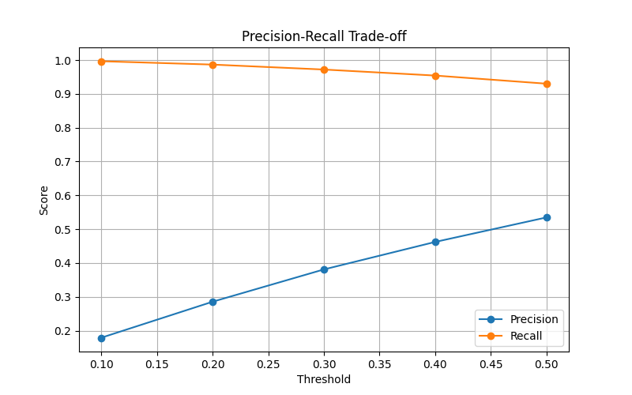
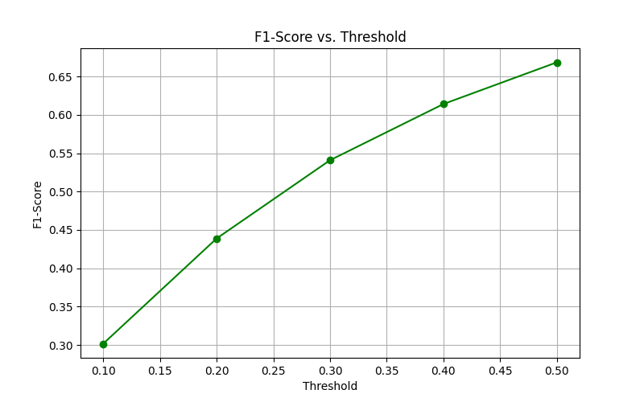
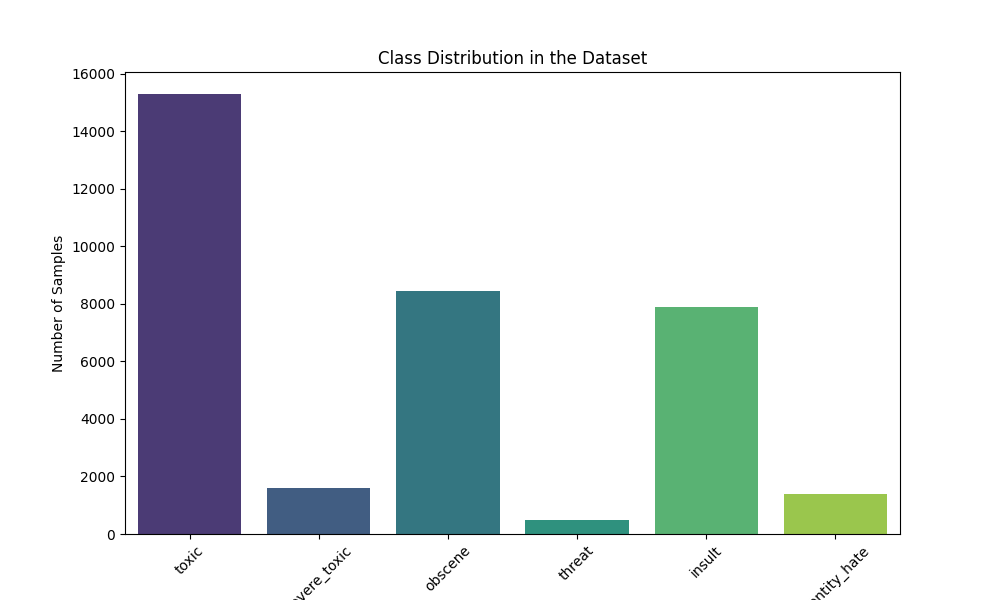
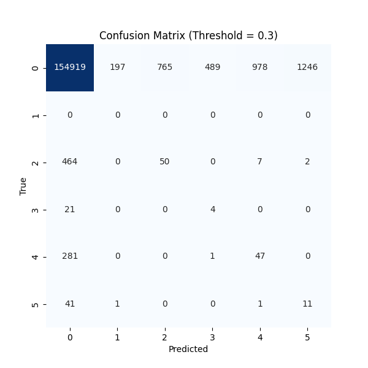

# Toxic Comment Detection System - Documentation

## **5.3 Graphs and Evaluation Results**

### **Graph 1: Precision-Recall Trade-off**

- **Thresholds**: [0.1, 0.2, 0.3, 0.4, 0.5]
- **Precision**: [Replace with actual precision values]
- **Recall**: [Replace with actual recall values]

### **Graph 2: F1-Score vs. Threshold**

- **Thresholds**: [0.1, 0.2, 0.3, 0.4, 0.5]
- **F1-Scores**: [Replace with actual F1-score values]

### **Graph 3: Class Distribution**

- **Class Distribution**:
  - Toxic: [Replace with actual count]
  - Severe Toxic: [Replace with actual count]
  - Obscene: [Replace with actual count]
  - Threat: [Replace with actual count]
  - Insult: [Replace with actual count]
  - Identity Hate: [Replace with actual count]

### **Graph 4: Confusion Matrix**

- **Confusion Matrix**:
  - True Positives (TP): [Replace with actual value]
  - False Positives (FP): [Replace with actual value]
  - True Negatives (TN): [Replace with actual value]
  - False Negatives (FN): [Replace with actual value]

### **5.4 Detailed Evaluation Results**
For detailed evaluation results, see [evaluation_results.txt](evaluation_results.txt).